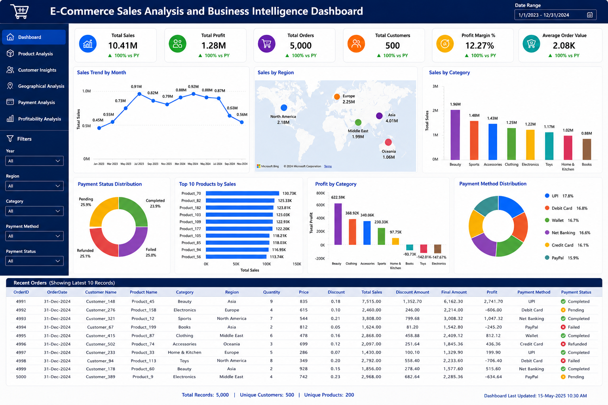

# E-Commerce Sales Analysis & Business Intelligence Dashboard

[](https://globale-commercesalesanalysismini-project-tdfhfdcjnh5zyoncykzr.streamlit.app/)

[]()
[]()
[]()
[]()

An end-to-end **Data Analytics, Machine Learning, and Business Intelligence project** built using **Python, Streamlit, Plotly, Scikit-learn, and Power BI**.

---

# Project Overview

The **E-Commerce Sales Analysis & Business Intelligence Dashboard** is a complete end-to-end Data Analytics and Machine Learning project developed using:

- Python
- Pandas
- NumPy
- Plotly
- Streamlit
- Scikit-learn
- Power BI

This project demonstrates the complete analytics lifecycle including:

- Data generation
- Data preprocessing
- Data cleaning
- Data merging
- Exploratory Data Analysis (EDA)
- Feature engineering
- Statistical analysis
- Interactive visualization
- Machine learning
- Dashboard development
- Web application deployment

The interactive Streamlit application enables users to analyze:

- Customer behavior
- Product performance
- Regional sales
- Profitability
- Payment trends
- Sales forecasting

through an intuitive Business Intelligence dashboard.

---

# Table of Contents

- Project Overview
- Problem Statement
- Project Objectives
- Live Streamlit Application
- Business Intelligence Dashboard
- Dataset Description
- Project Workflow
- Feature Engineering
- Exploratory Data Analysis
- Machine Learning
- Dashboard Features
- Skills Demonstrated
- Tools & Technologies
- Project Structure
- Installation
- Key Business Insights
- Final KPIs
- Future Enhancements
- Conclusion

---

# Problem Statement

Modern e-commerce businesses generate massive volumes of customer, product, order, and payment data every day.

Analyzing this information is essential for:

- Understanding customer purchasing behavior
- Identifying high-performing products
- Improving profitability
- Optimizing sales strategies
- Supporting data-driven business decisions

This project performs comprehensive analysis using Python-based data analytics, Pandas operations, statistical analysis, machine learning, and business intelligence visualization to provide meaningful business insights.

---

# Project Objectives

The main objectives of this project are:

- Customer Behavior Analysis
- Product Performance Analysis
- Sales Trend Analysis
- Profitability Analysis
- Regional Performance Analysis
- Payment Method Analysis
- SQL-Style Business Reporting
- Interactive Business Intelligence Dashboard
- Sales Prediction using Machine Learning

---

# Live Streamlit Application

## Launch the Interactive Dashboard

Live Application:

https://globale-commercesalesanalysismini-project-tdfhfdcjnh5zyoncykzr.streamlit.app/

The deployed Streamlit application allows users to:

- View Business KPIs
- Analyze Customer Behavior
- Analyze Product Performance
- Explore Regional Sales
- Monitor Payment Methods
- Visualize Monthly Sales Trends
- Predict Final Sales Amount using Machine Learning
- Download Filtered Data

---

# Business Intelligence Dashboard



---

# Dataset Description

A custom synthetic E-Commerce Sales dataset was created to simulate real-world online business operations.

The project contains five datasets:

- customers.csv
- products.csv
- orders.csv
- payments.csv
- final_merged_dataset.csv

The final merged dataset combines:

- Customer information
- Product details
- Sales transactions
- Payment information
- Discounts
- Revenue
- Profitability metrics

## Dataset Size

| Dataset | Records |
|---|---:|
| Customers | 500 |
| Products | 200 |
| Orders | 5,000 |
| Payments | 5,000 |

---

# Project Workflow

The complete workflow followed in this project:

1. Data Generation
2. Data Collection
3. Data Cleaning
4. Data Transformation
5. Data Merging
6. Feature Engineering
7. Exploratory Data Analysis
8. Statistical Analysis
9. Data Visualization
10. Machine Learning Model Development
11. Streamlit Dashboard Development
12. Power BI Dashboard Creation
13. Streamlit Deployment

---

# Feature Engineering

The following business features were created:

| Feature | Description |
|---|---|
| TotalSales | Quantity × Price |
| DiscountAmount | Applied discount value |
| FinalAmount | Final transaction amount |
| Profit | Revenue - Cost |
| Profit Margin | Profit percentage |

These features improved business analysis and machine learning performance.

---

# Exploratory Data Analysis

The project includes:

## Sales Analysis

- Sales trend analysis
- Monthly revenue analysis
- Order distribution

## Product Analysis

- Category-wise revenue analysis
- Product performance analysis
- Profit contribution

## Customer Analysis

- Customer purchasing behavior
- High-value customers
- Revenue contribution

## Regional Analysis

- Regional sales comparison
- Revenue distribution

## Payment Analysis

- Payment method analysis
- Revenue contribution by payment type

## Statistical Analysis

- Correlation analysis
- Distribution analysis
- Business KPI analysis

---

# Machine Learning

## Model Used

**Linear Regression**

---

## Machine Learning Pipeline

1. Data Preparation
2. Feature Selection
3. Train-Test Split
4. Model Training
5. Prediction
6. Performance Evaluation

---

## Input Features

The model uses:

- Quantity
- Price
- CostPrice
- Discount

---

## Target Variable

```
FinalAmount
```

---

## Evaluation Metrics

- Mean Absolute Error (MAE)
- Mean Squared Error (MSE)
- R² Score

---

## Model Performance

**R² Score: 0.86**

The model demonstrates good predictive performance for estimating Final Sales Amount.

---

# Dashboard Features

The Business Intelligence dashboard includes:

- Interactive KPI Dashboard
- Revenue Analysis
- Profit Analysis
- Customer Insights
- Product Performance
- Regional Sales Analysis
- Payment Analysis
- Sales Trend Visualization
- Correlation Heatmap
- Machine Learning Prediction
- Dataset Explorer
- Interactive Filters
- Download Filtered Dataset

---

# Skills Demonstrated

This project demonstrates practical skills in:

- Data Cleaning
- Data Preprocessing
- Exploratory Data Analysis
- Statistical Analysis
- Feature Engineering
- Data Visualization
- Machine Learning Model Development
- Business Intelligence Reporting
- Dashboard Development
- Streamlit Application Development
- Power BI Dashboard Creation
- Data Analytics Workflow

---

# Tools & Technologies

## Programming Language

- Python

## Data Analysis

- Pandas
- NumPy

## Visualization

- Plotly
- Matplotlib
- Power BI

## Machine Learning

- Scikit-learn

## Application Development

- Streamlit

## Development Tools

- Jupyter Notebook
- Git
- GitHub

---

# Project Structure

```text
E-Commerce-Sales-Analysis/
│
├── app.py
├── requirements.txt
├── README.md
├── Mini-Project.ipynb
├── customers.csv
├── products.csv
├── orders.csv
├── payments.csv
├── final_merged_dataset.csv
└── Business_Intelligence_Dashboard.png
```

---

# Quick Start Guide for Installation

Follow the steps below to explore the E-Commerce Sales Analysis Dashboard.

## Step 1: Download the Project

Download the project files from this repository and open the project folder on your local machine.

---

## Step 2: Install the Required Libraries

Install all project dependencies using the provided requirements file.

```bash
pip install -r requirements.txt
```

---

## Step 3: Launch the Dashboard

Start the Streamlit application by running the following command:

```bash
streamlit run app.py
```

---

## Step 4: Explore the Dashboard

Once the application starts, you can:

- View interactive business KPIs
- Analyze sales and profitability
- Explore customer and product insights
- Visualize regional and payment trends
- Predict Final Sales Amount using Machine Learning
- Download filtered datasets for further analysis

---

## Online Demo

The project is also available as a live web application:

https://globale-commercesalesanalysismini-project-tdfhfdcjnh5zyoncykzr.streamlit.app/

---

# Key Business Insights

The analysis generated the following insights:

- Beauty category generated the highest revenue among all product categories.
- Asia generated the highest overall revenue, followed by Europe and North America.
- UPI contributed the highest revenue among payment methods.
- Strong positive correlation exists between Price, Total Sales, and Final Amount.
- A small group of customers contributed a significant share of total revenue.
- Monthly sales remained consistent throughout 2023 and 2024.
- The Linear Regression model achieved an R² Score of approximately **0.86**.

---

# Final KPIs

| KPI | Value |
|---|---:|
| Total Revenue | **10.41M** |
| Total Profit | **1.28M** |
| Total Orders | **5,000** |
| Total Customers | **500** |
| Total Products | **200** |

---

# Future Enhancements

Future improvements include:

- Real-time Database Integration
- Cloud Deployment
- User Authentication
- Customer Recommendation System
- Advanced Machine Learning Models
- AI-Based Sales Forecasting
- Interactive Business Reports
- Real-Time Analytics Dashboard

---

# Project Status

Completed

___

# Conclusion

The **E-Commerce Sales Analysis & Business Intelligence Dashboard** demonstrates a complete Business Intelligence and Data Analytics solution using:

- Python
- Streamlit
- Plotly
- Scikit-learn
- Power BI

The project integrates:

- Data preprocessing
- Exploratory data analysis
- Statistical analysis
- Feature engineering
- Machine learning
- Interactive visualization
- Dashboard development
- Deployment

This solution provides meaningful insights into customer behavior, product performance, sales trends, and profitability while demonstrating practical implementation of modern data analytics and business intelligence techniques.

